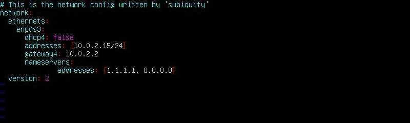
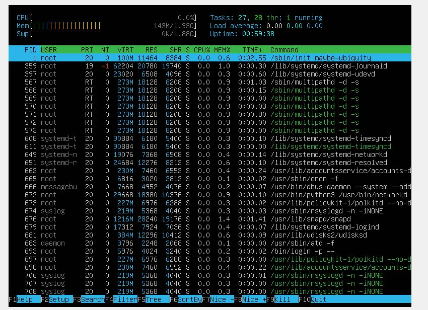
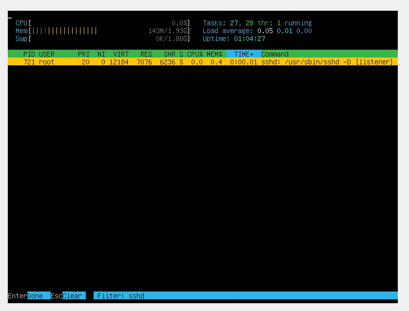
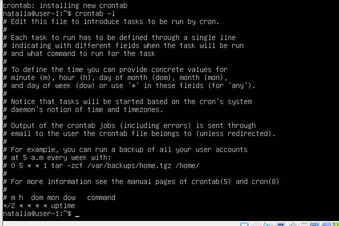

## №1. Установка ОС

<ol>
<li>

Узнайте версию Ubuntu, выполнив команду

> cat /etc/issue

</li>
</ol>

## №2. Создание пользователя

<ol>
<li>

Создания нового пользователя:

> sudo adduser school21

Вам будет предложено ввести пароль для нового пользователя и дополнительные сведения о пользователе, такие как имя и номер телефона (эти поля можно оставить пустыми, нажав "Enter" по умолчанию).</li>
<li>

Добавление в группу "adm":
Запустите следующую команду, чтобы добавить нового пользователя в группу "adm":

> sudo usermod -aG adm school21

Здесь:  
`usermod` - команда для модификации данных пользователя.  
`-aG adm` - ключи, означающие добавление пользователя (-a) в группу (-G) с именем "adm".  
`newuser` - имя созданного вами нового пользователя.</li>
<li>

Вставьте скриншот вызова команды для создания пользователя.

</li>
<li>

Новый пользователь должен быть в выводе команды

> cat /etc/passwd

</li>
</ol>

## №3. Настройка сети ОС

<ol>
<li>

Задайте название машины вида user-1  
Чтобы изменить название машины выполните следующие команды:  
> sudo vim /etc/hostname  
> reboot  

</li>
<li>

Проверьте текущую временную зону  

> timedatectl

Список доступных временных зон  

> timedatectl list-timezones

Установите временную зону, соответствующую вашему текущему местоположению  

> sudo timedatectl set-timezone Zone/Subzone

</li>
<li>

Выведите названия сетевых интерфейсов с помощью консольной команды  

> ip link show

lo или local loopback (локальная петля). Служит для подключения по сети к этому же компьютеру и не требует дополнительной настройки</li>
<li>

Получитe ip адрес устройства, на котором вы работаете, от DHCP сервера.

> ip a

Dynamic Host Configuration Protocol (DHCP) — автоматический предоставляет IP адреса и прочие настройки сети (маску сети, шлюз и т.п) компьютерам и различным устройствам в сети.</li>
<li>

Определите и выведите на экран внешний ip-адрес шлюза (ip) и внутренний IP-адрес шлюза, он же ip-адрес по умолчанию (gw).  

> curl ifconfig.me  
> ip route | grep dafault

</li>

46.138.176.90 - внешний адрес  
10.0.2.2 - внутренний адрес

<li>
Задать статичные (заданные вручную, а не полученные от DHCP сервера)

> sudo nano /etc/netplan/00-installer-config.yaml

Внутри редактора измените содержимое файла на следующее (замените enp0s3 на имя вашего сетевого интерфейса, addresses на желаемый статичный IP-адрес, gateway4 на IP-адрес вашего шлюза, и 8.8.8.8 на IP-адрес DNS-сервера):

Редактируем  

  

Проверяем изменения  

  

Пингуем удалённые хосты  

  

</li>
</ol>

## №4. Обновление ОС

<ol>
<li>

Обновите системные пакеты до последней на момент выполнения задания версии  

</li>
</ol>

## №5. Использование команды sudo

<ol>
<li>

Разрешите пользователю, созданному в Part 2, выполнять команду sudo.  
Sudo — это утилита, предоставляющая привилегии root для выполнения административных операций в соответствии со своими настройками. Она позволяет легко контролировать доступ к важным приложениям в системе. По умолчанию, при установке Ubuntu первому пользователю (тому, который создаётся во время установки) предоставляются полные права на использование sudo. Т.е. фактически первый пользователь обладает той же свободой действий, что и root.</li>

> sudo usermod -aG sudo school21  
> su - school21  

> hostname user-2  

</li>
</ol>

## №6. Установка и настройка службы времени

<ol>
<li>

Настройте службу автоматической синхронизации времени.  
Вывод следующей команды должен содержать NTPSynchronized=yes:
timedatectl show

> sudo apt install -y ntp  
> sudo systemctl enable ntp  
> sudo systemctl start ntp  
> timedatectl show  

</li>
</ol>

## №7. Установка и использование текстовых редакторов

<ol>
<li>

Установите текстовые редакторы VIM (+ любые два по желанию NANO, MCEDIT, JOE и т.д.)  
> sudo apt install vim  
> sudo apt install nano  
> sudo apt install mcedit
</li>
<li>

Используя каждый из трех выбранных редакторов, создайте файл test_X.txt, где X -- название редактора, в котором создан файл. Напишите в нём свой никнейм, закройте файл с сохранением изменений.</li>
<li>

Используя каждый из трех выбранных редакторов, откройте файл на редактирование, отредактируйте файл, заменив никнейм на строку "21 School 21", закройте файл без сохранения изменений.</li>
<li>

Используя каждый из трех выбранных редакторов, отредактируйте файл ещё раз (по аналогии с предыдущим пунктом), а затем освойте функции поиска по содержимому файла (слово) и замены слова на любое другое.</li>

<ul>

#### VIM

> vim test_VIM.txt  

- vim test_VIM.txt
- Режим редактирования: I
- Выйти из режима редактирования: esc
- Выход с охранением: :wq
- Выход без сохранения: :q
- Поиск: /<текст, который хотим найти>
- Замена: :s/<что хотим изменить>/<на что хотим заменить>
Например: %s/School/University/g

#### MCEDIT

> mcedit test_NANO.txt  

- mcedit test_mcedit.txt
- Выход с охранением: F2 (yes) + F10
- Выход без сохранения: F10(no)
- Поиск: F7 + <текст который ищем> + <ок>
- Замена: F4 + <что хотим изменить> + <на что хотим заменить> + replace

#### NANO

> nano test_NANO.txt  

- nano test_NANO.txt
- Выход с сохранением: CTRL + x, затем y и enter
- Выход без сохранения: CTRL + x, затем n
- Поиск: CTRL + W, затем enter (alt + w для перехода к след. вхождению, ctrl + c для преращения поиска)
- Замена: CTRL + \\+ <что хотим изменить + enter> + <на что хотим заменить + enter> + A(для замены все вхождения) или y и n по отдельности
</ul>
</ol>

## №8. Установка и базовая настройка сервиса SSHD

<ol>
<li>

Установить службу SSHd.

- sudo apt-get install ssh
- sudo apt install openssh-server  
</li>

<li>

Добавить автостарт службы при загрузке системы.

- sudo systemctl enable ssh
- systemctl status ssh  
</li>

<li>

Перенастроить службу SSHd на порт 2022.

- sudo vim /etc/ssh/sshd_config
- systemctl restart sshd  

</li>
<li>
Используя команду ps, показать наличие процесса sshd. Для этого к команде нужно подобрать ключи.

- `ps` (показывает запущенные процессы, выполняемые пользователем в окне терминала);
- `ps -e` или `ps -A` (Чтобы просмотреть все запущенные процессы);
- `ps -d` (Чтобы показать все процессы, кроме лидеров сессии);
- `ps -d -N` (можно инвертировать вывод с помощью переключателя -N. Например, если хочу вывести только лидеров сеансов)
- `ps T` (увидеть только процессы, связанные с этим терминалом);
- `ps r` (просмотреть все работающие (running) процессы);
- `ps -p` 'pid' (если вы знаете идентификатор процесса PID, вы можете просто использовать следующую команду, для вывода процесса с этим 'pid');
-`ps -p` 'pid1' 'pid2'
- ps U 'userlist' (найти все процессы, выполняемые конкретным пользователем);
- `ps -ef` (получить полный список);

</li>

<li>

Перезагрузить систему</li>

### NETSTAT

  

- -t (--tcp) отображает соедниеня только по tcp
- -a (--all) вывод всех активных подключений TCP
- -n (--numeric) вывод активных подключений TCP с отображением адресов и номеров портов в числовом формате
- Proto: Название протокола (протокол TCP или протокол UDP);
- recv-Q: очередь получения сети
- send-Q: Сетевая очередь отправки
- Local Address адрес локального компьтера и используемы номер порта
- Foreign Address адрес и номер удаленного компьтера к которомц подключен сокет
- State состояние сокетв
- 0.0.0.0 означает IP-адрес на локальной машине

</ol>

## №9. Установка и использование утилит top, htop

### Установить и запустить утилиты top и htop

<ol>
<li>

По выводу команды top определить и написать в отчёте:

- uptime - 44min;
- количество авторизованных пользователей - 1;
- общую загрузку системы - 0.23, 0.12, 0.04
- общее количество процессов - 97;
- загрузку cpu - 0.0 us, 0.0 sy, 0.0 ni, 99.3 id, 0.3 wa, 0.0 hi, 0.3 si, 0.0 st;
- загрузку памяти - 144,2/634,1;
- pid процесса занимающего больше всего памяти - 1452 (top -o %MEM);
- pid процесса, занимающего больше всего процессорного времени - 1625 (top -o %CPU);

</li>
<li>В отчёт вставить скрин с выводом команды htop:

  - отсортированному по PID, PERCENT_CPU, PERCENT_MEM, TIME
    
    
    
    
    
  - отфильтрованному для процесса sshd
    
    
  - с процессом syslog, найденным, используя поиск
    
    
  - с добавленным выводом hostname, clock и uptime
    
    

</li>
</ol>

## №10. Использование утилиты fdisk

<ol>
<li>

  Запустить команду fdisk -l

  
  

  - название жесткого диска - vbox harddisk;
  - размер - 15.98GiB;
  - количество секторов - 33465424;
  - размер swap - 1.9GiB.

</li>
</ol>

## №11. Использование утилиты df

<ol>
<li>Запустить команду df.
   В отчёте написать для корневого раздела (/):

  - размер раздела - 10218772;
  - размер занятого пространства - 4806884;
  - размер свободного пространства - 4871216;
  - процент использования - 50%;  

  Определить и написать в отчёт единицу измерения в выводе - килобайт

  

</li>
<li>Запустить команду df -Th.  
   В отчёте написать для корневого раздела (/):

  - размер раздела - 9.8G;
  - размер занятого пространства - 4.6G;
  - размер свободного пространства - 4.7G;
  - процент использования - 50%  

  Определить и написать в отчёт тип файловой системы для раздела - ext4.

  

</li>
</ol>

## №12. Использование утилиты du

<ol>
<li> 

Запустить команду du.

</li>
<li> 

Вывести размер папок /home, /var, /var/log (в байтах)

Вывести размер папок /home, /var, /var/log (в человекочитаемом виде)

</li>
<li>

Вывести размер всего содержимого в /var/log (не общее, а каждого вложенного элемента, используя \-)

   

</li>
</ol>

## №13. Установка и использование утилиты ncdu

<ol>
<li>
Установить утилиту ncdu. Вывести размер папок /home, /var, /var/log.

   > sudo apt-get install ncdu  

   
   
   
</li>
</ol>

## №14. Работа с системными журналами

sudo vim /var/log/dmesg  
sudo vim /var/log/syslog  
sudo vim /var/log/auth.log

<ol>
<li>Написать в отчёте время последней успешной авторизации, имя пользователя и метод входа в систему (17:50:54; natalia by LOGIN)
</li>
<li> Перезапустить службу SSHd.

  > sudo systemctl restart ssh
</li>
<li>

Вставить в отчёт скрин с сообщением о рестарте службы (искать в логах).

   
   

</li>
</ol>

## №15. Использование планировщика заданий CRON

<ol>
<li> 

Используя планировщик заданий, запустите команду uptime через каждые 2 минуты.

    
</li>
<li>

Найти в системных журналах строчки (минимум две в заданном временном диапазоне) о выполнении.
  > grep "uptime" /var/log/syslog

    

</li>

<li> 

Удалите все задания из планировщика заданий.

    

</li>
</ol>

