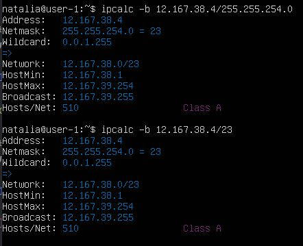
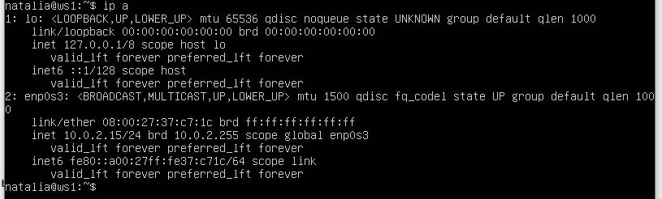
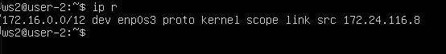
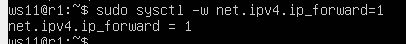
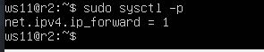
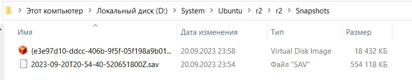
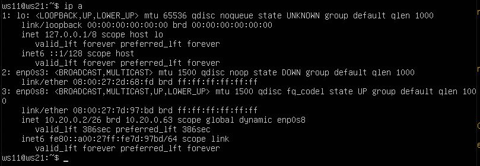
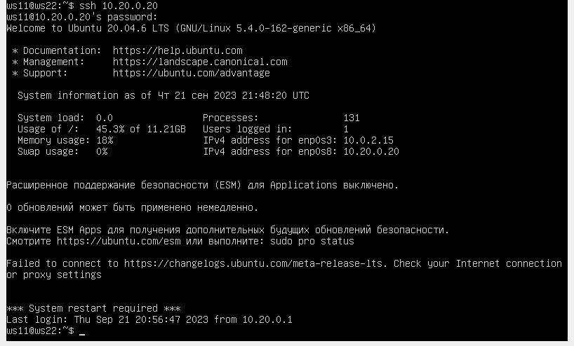
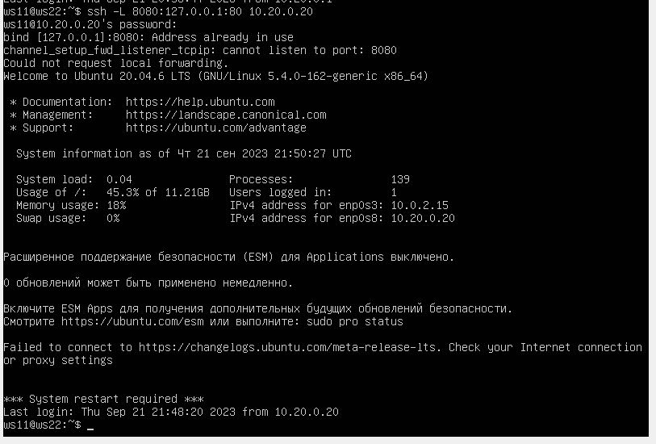

## Part 1. Инструмент ipcalc

`ipcalc` - это утилита командной строки, предназначенная для анализа и вычисления параметров сетевых IP-адресов и подсетей. Она позволяет быстро получать информацию о сетях, подсетях, адресах, масках и других сетевых параметрах. ipcalc полезен при настройке сетей, подсетей, маршрутизации и анализе сетевой конфигурации.

С помощью `ipcalc` вы можете выполнять следующие задачи:

* Вычисление адресов сети и широковещательных адресов на основе IP-адреса и маски подсети.
* Определение количества доступных хостов в подсети.
* Анализ параметров сети, таких как класс IP-адреса, биты сети и биты хоста.
* Проверка совместимости IP-адресов и масок подсетей.
* Генерация информации о подсетях для различных IP-адресов.

### 1.1. Сети и маски

#### 1.1.1 Определяем адрес сети *192.167.38.54/13* с помощью команды

> ` ipcalc 192.167.38.54/13 `

#### 1.1.2 Перевод маски: 

> ` ipcalc 192.167.38.54/255.255.255.0 `

* префиксная форма записи */24* 
* двоичная форма записи *11111111.11111111.11111111.00000000*
  

> ` ipcalc 192.167.38.54/15 `

* обычная форма записи *255.254.0.0*
* двоичная *11111111.11111110.00000000.00000000*

> ` ipcalc 192.167.38.54/11111111.11111111.11111111.11110000 `
* обычная форма записи *255.255.255.240*
* префиксная */28*

#### 1.1.3 Минимальный и максимальный хост в сети 12.167.38.4 при масках:

> ` ipcalc 12.167.38.4/8 `

* минимальный хост *12.0.0.1*
* максимальный хост *12.255.255.254* 

> ` ipcalc 12.167.38.4/11111111.11111111.00000000.00000000 `

эквивалентно

> ` ipcalc 12.167.38.4/16 `

* минимальный хост *12.167.0.1*
* максимальный хост *12.167.255.254*

> ` ipcalc 12.167.38.4/255.255.254.0 `

эквивалентно

> ` ipcalc 12.167.38.4/23 `

* минимальный хост *12.167.38.1*
* максимальный хост *12.167.39.254*

> ` ipcalc 12.167.38.4/4 `

* минимальный хост *0.0.0.1*
* максимальный хост *15.255.255.254*

### 1.2. localhost

Определить и записать в отчёт, можно ли обратиться к приложению, работающему на localhost, со следующими IP: 194.34.23.100, 127.0.0.2, 127.1.0.1, 128.0.0.1 .

* приложения к которым можно обратиться через localhost: *127.0.0.2, 127.1.0.1*

> ` ping -c 2 <IP-address> `

- ` -c ` - указывает количество пакетов.

> ` ping -с 2 127.0.0.2 `

> ` ping -с 2 127.1.0.1 `

* приложения к которым нельзя обратиться через localhost: *194.34.23.100, 128.0.0.1*

> ` ping -с 2 194.34.23.100 `

> ` ping -с 2 128.0.0.1 `

### 1.3. Диапазоны и сегменты сетей

#### 1.3.1 Определить и записать в отчёт какие из перечисленных IP можно использовать в качестве публичного, а какие только в качестве частных: 10.0.0.45, 134.43.0.2, 192.168.4.2, 172.20.250.4, 172.0.2.1, 192.172.0.1, 172.68.0.2, 172.16.255.255, 10.10.10.10, 192.169.168.1. 

*Публичный IP адрес* - называется IP адрес, который используется для выхода в Интернет. 
*Частный IP адрес* - адреса, используемые в локальных сетях (не может быть напрямую подключен к Интернету).

> ` ipcalc <IP-адрес> `

* к публичным относятся следующие IP адреса: *134.43.0.2, 172.0.2.1, 192.172.0.1, 172.68.0.2, 192.169.168.1*

* к частным относятся следующие IP адреса: *10.0.0.45, 192.168.4.2, 172.20.250.4, 172.16.255.255, 10.10.10.10*

#### 1.3.2 Определить и записать в отчёт какие из перечисленных IP адресов шлюза возможны у сети 10.10.0.0/18: 10.0.0.1, 10.10.0.2, 10.10.10.10, 10.10.100.1, 10.10.1.255

* из перечисленных IP адресов шлюзов у сети 10.10.0.0/18 возможны следующие: 10.10.0.2, 10.10.10.10, 10.10.1.255 .

## Part 2. Статическая маршрутизация между двумя машинами

#### 2.0.1 Поднимаем две виртуальные машины  ws1 и ws2.

В настройках каждой машины во вкладке Сеть задаем Тип подключения: Внутренняя сеть.

#### 2.0.2 С помощью команды *ip a* смотрим существующие сетевые интерфейсы

`ip` - предназначенная для управления сетевыми интерфейсами, маршрутизацией, адресами и другими сетевыми параметрами в операционных системах Linux.

С помощью ip вы можете выполнять различные задачи, такие как:
* Управление сетевыми интерфейсами: Вы можете создавать, настраивать и удалять сетевые интерфейсы, а также изменять их состояния.
* Назначение IP-адресов: Вы можете назначать IP-адреса сетевым интерфейсам и изменять их параметры, такие как маска подсети.
* Настройка маршрутизации: ip позволяет управлять таблицей маршрутизации, добавлять и удалять маршруты, изменять шлюзы и т. д.
* Отображение информации о сети: Вы можете использовать ip для просмотра информации о сетевых интерфейсах, адресах, маршрутах и т. д.

#### 2.0.3 Описать сетевой интерфейс, соответствующий внутренней сети, на обеих машинах и задать следующие адреса и маски: ws1 - 192.168.100.10, маска /16, ws2 - 172.24.116.8, маска /12

Используем следующую команду для открытия файла и установки в нём статического адреса.

> ` sudo vim /etc/netplan/00-installer-config.yaml `

- ` etc/netplan/00-installer-config.yaml ` - файл который нужно отредактировать на каждой машине. Этот файл отвечает за настройку интерфейсов сети.

Дописываем в файлы соответствующие строки.

#### 2.0.4 Выполним команду *netplan apply* для перезапуска сервиса сети

> ` sudo netplan apply `

С помощью следующей команды перепроверяем настройки

> ` ip a `

### 2.1. Добавление статического маршрута вручную

#### 2.1.1 Добавим статический маршрут от одной машины до другой и обратно

`netstat` - она предоставляет информацию о сетевых соединениях, сетевых интерфейсах, маршрутах и другой сетевой статистике.

> ` sudo ip route add 172.24.116.8 dev enp0s3 `

> ` sudo ip route add 192.168.100.10 dev enp0s3 `

#### 2.1.2 Пропингуем соединение между машинами с помощью следующей команды

> ` ping -c 3 172.24.116.8 `

> ` ping -c 3 192.168.100.10 `

### 2.2. Добавление статического маршрута с сохранением

Перезапустим машины (reboot), данные не сохранились

> ` ip r `

Добавляем статический маршрут от одной машины до другой, редактируя файл ` etc/netplan/00-installer-config.yaml `. 

> ` sudo vim etc/netplan/00-installer-config.yaml `

Добавляем блок, описывающий статический маршрут.

Применяем новые настройки с помощью команды 

> ` sudo netplan apply `

Пропингуем соединение между машинами

> ` ping -c 3 172.24.116.8 `

> ` ping -c 3 192.168.100.10 `

## Part 3. Утилита iperf3

`iperf3` является полезным инструментом для администраторов сетей и технических специалистов для оценки и оптимизации производительности сети.

С помощью iperf3 вы можете выполнять следующие задачи:
* Измерение пропускной способности: *iperf3* позволяет измерять скорость передачи данных между двумя устройствами в сети. Это полезно для определения, насколько быстро данные могут быть переданы между сервером и клиентом.
* Тестирование производительности сетевых соединений: Вы можете использовать *iperf3* для оценки производительности вашей сети, например, для определения, насколько эффективно работают соединения между компьютерами.
* Настройка параметров тестирования: *iperf3* позволяет настраивать параметры тестирования, такие как продолжительность, порт, протокол (TCP или UDP), размер данных и другие.

### 3.1. Скорость соединения

Для перевода используют следующие коэффиценты:
* 1 Mbps (мегабит в секунду) = 1000 Kbps (килобит в секунду)
* 1 Gbps (гигабит в секунду) = 1000 Mbps (мегабит в секунду)
* 1 MB/s (мегабайт в секунду) = 8 Mbps (мегабит в секунду)

Перевести и записать в отчёт:

* `8 Mbps = 8 / 8 = 1 MB/s`
* `100 MB/s = 100 * 8 * 1000 Kbps = 800000 Kbps`
* `1 Gbps = 1000 Mbps`

### 3.2. Утилита iperf3

#### 3.2.0 Изменения настроек VirtualBox для того чтобы у ws1 и ws2 появился доступ к внешней сети, чтобы установить iperf3

Для установки iperf3 (и других пакетов) на ваши виртуальные машины в VirtualBox, нам необходимо подключить интернет.

Инструкция:
1) Отключаем машины  ` ws1 ` и ` ws2 `.
2) Заходим в настройки каждой: ` ws ` *Сети - Адаптер_1* и устанавливаем *Тип подключения: NAT*.
3) Переходим тут же в *Адаптер_2*, устанавливаем галочку *Включить сетевой адаптер*. После включения адаптера устанавливаем *Тип подключения: Внутренняя сеть*.

4) После настройки машин ` ws1 ` и ` ws2 `, запускаем их. Необходдимо правильно отредактировать файл ` /etc/netplan/00-installer-config.yaml `.

3) Принимаем изменеия настроек сети и проверяем настройки интерфейсов

> ` sudo netplan apply `

> ` ip a `

4) После перезагрузки виртуальных машин можно убедиться что всё правильно настроено

Теперь можно устанавливать необходимые програмные пакеты.

#### 3.2.1 Измерим скорость соединения между ws1 и ws2 с помощью утилиты iperf3

Перед установкой необходимо обновление системы.

> ` sudo apt update & upgrade ` 

Установка утилиты ` iperf3 ` осуществляется с помощью команды

> ` sudo apt install iperf3 `

На ws1 запустите сервер iperf3. Откройте терминал на одной из машин и выполните:

> ` iperf3 -s ` 

Это запустит сервер iperf3, который будет слушать на порту 5201 (по умолчанию).

Следом запускаем на ` ws2 ` утилиту в режиме клиент с флагом ` -c ` и указываем IP-адрес ` ws1 `.

> ` iperf3 -c 192.168.100.10 ` 

Это запустит клиент iperf3, который попытается подключиться к серверу на указанном IP-адресе.

## Part 4. Сетевой экран

`Сетевой экран (или межсетевой экран)` - это технология или устройство, предназначенное для обеспечения безопасности сети и управления трафиком между различными сегментами сети или между внутренней сетью и внешней сетью (например, Интернетом). Эта технология обеспечивает контроль доступа к сети и фильтрацию сетевого трафика, чтобы защитить сеть от угроз и вредоносных действий.

Основные функции сетевого экрана включают:
* Фильтрация пакетов
* Сетевой адресат (NAT)
* Проверка безопасности
* Управление доступом
* Журналирование и мониторинг

### 4.1. Утилита iptables

`iptables` - это утилита командной строки для управления правилами фильтрации пакетов в Linux-системах с ядром, основанным на Netfilter. 

Основные функции iptables включают:

* Фильтрация пакетов: Вы можете определить правила, которые разрешают или блокируют сетевой трафик на основе различных критериев, таких как исходный и целевой IP-адрес, порт, протокол и т. д.

* Маскировка (NAT): iptables позволяет настраивать Network Address Translation (NAT), что полезно для перевода внутренних IP-адресов во внешние и обратно. Это позволяет внутренним устройствам в сети использовать общедоступные IP-адреса.

* Трансляция портов: iptables также поддерживает портовую трансляцию (port forwarding), которая позволяет перенаправлять входящий трафик на определенные порты к конкретным устройствам или службам в вашей сети.

* Управление состоянием соединений: Вы можете определять правила, которые учитывают состояние соединения, что позволяет разрешать только установленные и активные соединения.

* Блокировка DoS-атак и фильтрация спама: iptables может быть использован для снижения воздействия на вашу сеть различных атак и вредоносного трафика.

* Логирование сетевого трафика: Вы можете настроить логирование сетевых событий для дальнейшего анализа.

`iptables` предоставляет гибкие и мощные средства для настройки сетевой безопасности и фильтрации трафика в Linux-системах. Она широко используется администраторами сетей и систем для обеспечения безопасности и управления сетевой инфраструктурой.

Подсистема ` iptables ` и Netfilter уже достаточно давно встроена в ядро Linux. Все сетевые пакеты, которые проходят через компьютер, отправляются компьютером или предназначены компьютеру, ядро направляет через фильтр ` iptables `. Там эти пакеты поддаются проверкам и затем для каждой проверки, если она пройдена выполняется указанное в ней действие. Например, пакет передается дальше ядру для отправки целевой программе, или отбрасывается.

Инструкция использования: [сайт](https://losst.pro/nastrojka-iptables-dlya-chajnikov)

Создаем файл ` /etc/firewall.sh `, имитирующий фаерволл, на ` ws1 ` и ` ws2 ` с помощью команды

> ` sudo touch /etc/firewall.sh `

Добавляем в файл следующие правила согласно задания:

> ` sudo nano /etc/firewall.sh `

1) на ` ws1 ` применить стратегию когда в начале пишется запрещающее правило, а в конце пишется разрешающее правило (это касается пунктов 4 и 5).

2) на ` ws2 ` применить стратегию когда в начале пишется разрешающее правило, а в конце пишется запрещающее правило (это касается пунктов 4 и 5).

3) открыть на машинах доступ для порта 22 (ssh) и порта 80 (http).

4) запретить *echo reply* (машина не должна "пинговаться”, т.е. должна быть блокировка на OUTPUT).

5) разрешить *echo reply* (машина должна "пинговаться").

Запустим файлы на обеих машинах командами

> ` sudo chmod +x /etc/firewall.sh `

> ` sudo bash /etc/firewall.sh `

*Разница:*

Если правило не соответствует пакету, пакет передается следующему правилу. Если правило соответствует пакету, оно выполняет действие, указанное целью/вердиктом, что может привести к тому, что пакету будет разрешено продолжить движение по цепочке, а может и нет. Первое правило ws1 DROP разрывает цепочку, а первое правило ws2 ACCEPT разрывает цепочку, но пакеты ping передаются на ws2.

Соответсвенно одна машина, т.к. сначала идёт запрещающее правило. вторая машина будет, т.к. сначала идёт разрешающее правило.

### 4.2. Утилита nmap

[Справочное руководство Nmap](https://nmap.org/man/ru/index.html)

[Как пользоваться Nmap](https://losst.pro/kak-polzovatsya-nmap-dlya-skanirovaniya-seti)

`Nmap (Network Mapper)` - это мощный инструмент для сканирования сети и анализа безопасности. Он предоставляет информацию о устройствах, подключенных к сети, и их уязвимостях. Nmap предоставляет большой набор функций для исследования сетей и определения конфигурации устройств. Вот некоторые основные возможности `nmap`:

* **Сканирование портов:** Nmap может сканировать порты на удаленном устройстве, чтобы определить, какие из них открыты. Это позволяет определить, какие службы и сервисы работают на удаленном хосте.
* **Определение операционной системы:** Nmap может попытаться определить операционную систему удаленного хоста на основе характеристик сетевого стека и других параметров.
* **Обнаружение уязвимостей:** Nmap может искать уязвимости в открытых портах и службах на удаленном хосте. Он может использовать скрипты для автоматического обнаружения уязвимостей.
* **Сканирование сетевых сервисов:** Nmap может проводить более глубокий анализ сетевых сервисов, определяя их версии и характеристики.
* **Сканирование сетевых топологий:** Nmap может сканировать сетевые топологии, определяя устройства в сети и их связи.
* **Сканирование сетевых маршрутов:** Nmap может определить маршруты, которые используются в сети.
* **Сканирование виртуальных частных сетей (VPN):** Nmap может сканировать и анализировать виртуальные частные сети, включая VPN-соединения.
* **Аудит безопасности:** Nmap может использоваться для аудита безопасности сети и поиска уязвимых точек.
* **Сканирование наличия хостов:** Nmap может проверять доступность хостов в сети.
* **Сканирование сетевых устройств:** Nmap может сканировать устройства в сети, такие как маршрутизаторы и коммутаторы.

#### 4.2.1 Поиск машины, которая не "пингуется"

> ` ping IP-address `

В файле ` firewall.sh ` для первой машины первым было указано запрещающее правило, поэтому она не пингуется. Для проверки того чтобы показать, что хост машины запущен воспользуемся утилитой ` nmap `. 
Установим утилиту ` nmap ` с помощью следующей команды. Во время установки появится запрос, нужно будет согласиться.

> ` sudo apt install nmap `

Убеждаемся, что в выводе `nmap` есть строка **"Host is up"**, что будет означать, что хост машины запущен.

> ` sudo nmap IP-address `

#### 4.2.2 Сохраняем дампы образов виртуальных машин.

[Сохранение машины](https://comphome.ru/virtualbox-virtualnaja-mashina/kak-sohranit-sostojanie-virtualnoj-mashiny-virtualbox.html)

1) В настройках машины выбираем *Опции - Снимки*.

2) Выбираем *Сделать* и добавляем снимки. 

3) Задаём снимку имя и описываем его.

В папке goinfre, где сохранен образ виртуальной машины, появится новая папка *Snapshots*.

## Part 5. Статическая маршрутизация сети

Создадим сеть, по следующей схеме

#### 5.0.1 Поднимаем пять виртуальных машин (3 рабочие станции (ws11, ws21, ws22) и 2 роутера (r1, r2)).

Задаём следующие настройки виртуальным машинам:

**1)** Для машины ` r1 ` в *Настроить - Сеть* выставляем:
- *Адаптер_1* оставляем как есть (*Тип подключения: NAT*);
- включаем *Адаптер_2*, выставляем *Тип подключения: Внутренняя сеть* и устанавливаем имя ` int_net_1`;
- включаем *Адаптер_3*, выставляем *Тип подключения: Внутренняя сеть* и устанавливаем имя ` int_net_2`.

**2)** Для машины ` r2 `:
- *Адаптер_1* оставляем как есть (*Тип подключения: NAT*);
- Включаем *Адаптер_2*, выставляем *Тип подключения: Внутренняя сеть* и устанавливаем имя ` int_net_2`;
- Включаем *Адаптер_3*, выставляем *Тип подключения: Внутренняя сеть* и устанавливаем имя ` int_net_3`.

**3)** Для машины ` ws11 ` в *Настроить - Сеть*:
- *Адаптер_1* оставляем как есть (*Тип подключения: NAT*);
- включаем *Адаптер_2*, выставляем *Тип подключения: Внутренняя сеть* и устанавливаем имя ` int_net_1`.

**4)** Для машин ` ws21 ` и ` ws22 `:
- *Адаптер_1* оставляем как есть (*Тип подключения: NAT*);
- включаем *Адаптер_2*, выставляем *Тип подключения: Внутренняя сеть* и устанавливаем имя ` int_net_3`.

### 5.1. Настройка адресов машин

#### 5.1.1 Настроить конфигурации машин в etc/netplan/00-installer-config.yaml согласно сети на рисунке.

Проверяем какие интерфейсы есть на машине  ` r1 `.

> ` ip a `

В файле ` etc/netplan/00-installer-config.yaml ` прописываем настройки для машин, согласно схемы сети. 

Используем следующую команду:

> ` sudo vim /etc/netplan/00-installer-config.yaml `

#### 5.1.2 Перезапустить сервис сети и проверить адрес машины

Перезапускаем сервисысети.

> ` sudo netplan apply `

Проверим, что адрес машины задан верно. 

> ` ip -4 a `

Пропингуем ` ws22 ` с ` ws21 `  

> ` ping -c 3 10.20.0.10 `
 

Пингуем ` r1 ` с ` ws11 ` 

> ` ping -c 3 10.10.0.2 `

### 5.2. Включение переадресации IP-адресов.

Выполните следующие шаги:

**1)** Выполните команду для включения переадресации IP в текущей сессии:

> `sudo sysctl -w net.ipv4.ip_forward=1`

**2)** Чтобы активировать данную настройку после перезагрузки системы, отредактируйте файл `/etc/sysctl.conf` следующей командой:

> `sudo vim /etc/sysctl.conf`

**3)** Найдите строку `net.ipv4.ip_forward=1` и раскомментируйте её, если она закомментирована (уберите символ `#` в начале строки).

**4)** Сохраните изменения и закройте текстовый редактор.

**5)** Для применения настроек из файла `/etc/sysctl.conf`, выполните следующую команду:

> `sudo sysctl -p`

Теперь настройка переадресации IP будет активирована после перезагрузки системы.

### 5.3. Установка маршрута по-умолчанию

Настраиваем маршрут по-умолчанию (шлюз) для рабочих станций. Для этого добавляем ` gateway4: ip роутера ` в файле конфигураций ` etc/netplan/00-installer-config.yaml `

> ` sudo vim /etc/netplan/00-installer-config.yaml `

После изменения настроек применяем команду для вступления в силу изменений

> ` sudo netplan apply `

Вызовем ` ip r `, чтобы показать, что  маршрут добавился в таблицу маршрутизации

Пропингуем с ` ws11 ` роутер ` r2 `, пинг не пройдёт, т.к. роутер "не знает" куда вернуть ответ, при этом передача пакетов с машины осуществляется. 

Чтобы посмотреть какие девайсы можно прослушать

> ` tcpdump -D ` 

Запускаем на ` r2 ` утилиту ` tcpdump `, она позволяет прослушать порты и вывести на экран информацию с каких IP адресов приходят пакеты. В данном случае слушаем интерфейс ` enp0s8 `

> ` sudo tcpdump -tn -i enp0s8 `

Сначала на экране r2 будет пусто, идёт ожидание входящих пакетов

Запускаем ` ping ` на ` ws11 ` 

> ` ping -c 3 10.100.0.12`

На экране должно ` r2 ` должно появиться 

### 5.4. Добавление статических маршрутов

#### 5.4.1 Добавить в роутеры r1 и r2 статические маршруты в файле конфигураций.

Отредактируем файлы конфигураций сети путем изменения содержания файла ` etc/netplan/00-installer-config.yaml ` для каждого роутера.

> ` sudo vim /etc/netplan/00-installer-config.yaml `

Для вступления изменений в силу воспользуемся командой

> ` sudo netplan apply `

С помощью ` ip r ` проверяем настройки на роутерах

- 10.20.0.0/26 через 10.100.0.12 устройство enp0s9

- 10.10.0.0/18 через 10.100.0.11 устройство enp0s8

Запустить команды на ` ws11 `

> ` ip r list 10.10.0.0/18 `

> ` ip r list 0.0.0.0/0 `

Для адреса *10.10.0.0/18* был выбран маршрут, отличный от *0.0.0.0/0* (он попадает под маршрут по-умолчанию), т.к. машина ` ws11 ` соединена с сетью *10.10.0.0/18* по своему IP-адресу *10.10.0.2*, для других адресов используется маршрут по умолчанию, который указан в файле *10.10.0.1*.

### 5.5. Построение списка маршрутизаторов

Для установки утилиты на ` ws11 ` используем команду 

> ` sudo apt install traceroute `

Запустим на ` r1 ` команду дампа 

> ` sudo tcpdump -tnv -i enp0s8 `

- -n - не конвертировать адреса в имена;
- -t - не выводить время при выводе каждой строкчи дампа;
- -v - при синтаксическом анализе и выводить более подробную информацию. Например, печатаются время создания, общая длина и параметры IP-пакета. Также включает дополнительные проверки целостности пакетов, такие как проверка контрольной суммы заголовка IP и ICMP.

При помощи утилиты ` traceroute ` построим список маршрутизаторов на пути от ` ws11 ` до ` ws21 `. 

>Каждый пакет проходит на своем пути определенное количество узлов, пока достигнет своей цели. Причем, каждый пакет имеет свое время жизни. Это количество узлов, которые может пройти пакет перед тем, как он будет уничтожен. Этот параметр записывается в заголовке TTL, каждый маршрутизатор, через который будет проходить пакет уменьшает его на единицу. При TTL=0 пакет уничтожается, а отправителю отсылается сообщение Time Exceeded.

>Команда traceroute linux использует UDP пакеты. Она отправляет пакет с TTL=1 и смотрит адрес ответившего узла, дальше TTL=2, TTL=3 и так пока не достигнет цели. Каждый раз отправляется по три пакета и для каждого из них измеряется время прохождения. Пакет отправляется на случайный порт, который, скорее всего, не занят. Когда утилита traceroute получает сообщение от целевого узла о том, что порт недоступен трассировка считается завершенной.

### 5.6. Использование протокола ICMP при маршрутизации

Запустим на ` r1 ` перехват сетевого трафика, проходящего через ` enp0s8 ` с помощью команды

> ` sudo tcpdump -n -i enp0s8 icmp `

Пропингуем с ` ws11 ` несуществующий IP (например, 10.30.0.111) с помощью команды 

> ` ping -c 3 10.30.0.111 `

Сохраняем дампы образов виртуальных машин

## Part 6. Динамическая настройка IP с помощью DHCP

[DHCP](https://sysadmin-note.ru/article/ustanovka-i-nastrojka-dhcp-servera-v-ubuntu/) (Dynamic Host Configuration Protocol) - это протокол, который используется в компьютерных сетях для динамической настройки сетевых параметров устройствам, подключенным к сети. DHCP позволяет автоматически назначать IP-адреса, маски подсети, шлюзы по умолчанию и другие сетевые настройки клиентским устройствам, что делает процесс настройки сети более удобным и автоматизированным.

### 6.1 Настройка службы DHCP на r2

Если утилита ` isc-dhcp-server ` ещё не установлена, то файла ` /etc/dhcp/dhcpd.conf ` ещё не существует в нужном виде. Соотвтетственно для работы с протоколом **DHCP** сначала надо установить эту утилиту

> ` sudo apt-get install isc-dhcp-server `

Теперь для **r2** можем настроить в файле ` /etc/dhcp/dhcpd.conf ` конфигурацию службы  ` DHCP `

1) указываем адрес маршрутизатора по-умолчанию, DNS-сервер и адрес внутренней сети.

Открываем файл ` /etc/dhcp/dhcpd.conf ` для редактирования

> ` sudo vim /etc/dhcp/dhcpd.conf `

2) в файле ` /etc/resolv.conf `(содержит адреса серверов имен, к которым имеет доступ данная система) прописываем ` nameserver 8.8.8.8 `

> ` sudo vim /etc/resolv.conf `

Перезагрузим службу **DHCP**

> ` systemctl restart isc-dhcp-server `

Можно проверить статус службы

> ` sudo systemctl status isc-dhcp-server `

Изменим настройки машин **ws21** и **ws22** в файле конфигурации, чтобы сделать протокол **DHCP** активным. На каждой машине введём

> ` sudo vim /etc/netplan/00-installer-config.yaml `

> ` sudo netplan apply `

Перезагружаем виртуальную машину **ws21**

> ` sudo systemctl reboot `

Проверяем присвоенный устройствам адрес

Проверим соединение машины **ws22** с **ws21** 

### 6.2 Указать MAC-адреса 

Чтобы указать MAC-адрес у **ws11**, в файл ` etc/netplan/00-installer-config.yaml ` надо добавить строки: ` macaddress: 10:10:10:10:10:BA `, ` dhcp4: true `

> ` sudo vim /etc/netplan/00-installer-config.yaml `

> ` sudo netplan apply `

[Выключаем](https://losst.ru/vyklyuchenie-linux-iz-komandnoj-stroki "Выключение LINUX из командной строки") машину **ws11**

> ` sudo shutdown -h now`

Заходим в менеджер виртуальных машин VirtualBox и там настраиваем **ws11** MAC-адрес

Для **r1** настроим аналогично **r2**, но выдачу адресов сделаем с жесткой привязкой к MAC-адресу (**ws11**).

> ` sudo apt-get install isc-dhcp-server `

> ` sudo vim /etc/dhcp/dhcpd.conf `

> ` sudo vim /etc/resolv.conf `

> ` systemctl restart isc-dhcp-server `

> ` sudo systemctl status isc-dhcp-server `

Проводим аналогичные тесты - смотрим какой адрес назначен машине **ws11**

> ` ip a `

Пропингуем соединение

> ` ping -c 3 10.10.0.4 `

### 6.3 Обновление ip адреса с помощью команды *sudo dhclient*.

Проверяем IP до обновления

Запросим с **ws21** обновление ip адреса с помощью команды

> ` sudo dhclient -v `

- ` -v ` - будет выведена дополнительная информация.

> ` ip a `

Выполним команду для удаления старого IP адреса

> ` sudo dhclient -r `

- ` -r ` - явно освобождает текущую аренду ip адреса.

Чтобы обновить или освободить IP-адрес для конкретного интерфейса, например, eth0, необходимо ввести:

> ` sudo dhclient -r eth0 `

> ` sudo dhclient eth0 `

Проверим IP адреса

> ` ip a `

> В части 6 были использованы следующие опции **DHCP** протокола:
  >* option routers *ip-address [, ip-address...];* - адреса шлюзов для клиентской сети. Маршрутизаторы должны быть перечислены в порядке предпочтительности.
  >* option domain-name-servers *ip-address [, ip-address...];* - Список DNS серверов  доступных клиенту. Сервера должны быть перечислены в порядке предпочтительности.

Сохраняем дампы образов виртуальных машин.

## Part 7. NAT

Для работы с сервером ` apache2 `, установим его на машины ` r1 `, ` r2 ` и ` ws22 `. Возможно ` apache2 ` не будет устанавливаться, тогда возможно поможет обновление системы (см. ниже).

> ` sudo apt install apache2 `

Обновление системы

> ` sudo apt update `

> ` sudo apt upgrade -y `
- ` -y ` - при запросе сразу согласиться с установкой.

### 7.1 Делаем сервер Apache2 общедоступным.

В файле ` /etc/apache2/ports.conf ` на ` ws22 ` и ` r1 ` меняем строку ` Listen 80 ` на ` Listen 0.0.0.0:80 `.

> ` sudo vim /etc/apache2/ports.conf `

Запустить веб-сервер **Apache** командой на ` ws22 ` и ` r1 `

> ` service apache2 start ` 

### 7.2 Создаем фаервол на r2 [(как в части 4)](#41-утилита-iptables). Следующие правила:

1) Удаление правил в таблице filter - ` iptables -F `
2) Удаление правил в таблице "NAT" - ` iptables -F -t nat `
3) Отбрасывать все маршрутизируемые пакеты - ` iptables --policy FORWARD DROP `

Запустим файл:

> ` sudo chmod +x /etc/firewall.sh `

> ` sudo bash /etc/firewall.sh `

 При запуске файла ` firewall.sh ` с этими правилами, ` ws22 ` не должна "пинговаться" с ` r1 `.

Проверяем соединение между ` r1 ` и ` ws22 `

> ` ping -c 3 10.20.0.20 `

Проверяем соединение между ` ws22 ` и ` r1 `

> ` ping -c 3 10.100.0.11 `

Добавить в файл ещё одно правило:

4) Разрешить маршрутизацию всех пакетов протокола ICMP, для этого прописываем правило для протокола *icmp* и цепочки *FORWARD*

> ` sudo vim /etc/firewall.sh`

> ` sudo bash /etc/firewall.sh `

Теперь при запуске файла ` firewall.sh ` с этими правилами, ` ws22 ` должна "пинговаться" с ` r1 `

Проверяем соединение между ` r1 ` и ` ws22 `

> ` ping -c 5 10.20.0.20 `

Проверяем соединение между ` ws22 ` и ` r1 `

> ` ping -c 3 10.100.0.11 `

Добавляем в файл ещё два правила:

5) Включаем **SNAT**, а именно маскирование всех локальных ip из локальной сети, находящейся за ` r2 ` (по обозначениям из Части 5 - сеть 10.20.0.0)

6) Включаем **DNAT** на 8080 порт машины ` r2 ` и добавим к веб-серверу Apache, запущенному на ` ws22 `, доступ извне сети

> ` sudo vim /etc/apache2/ports.conf `

> Значения использованных опций:
> - ` t ` - указывает на используемую таблицу;
> - ` p ` - указывает протокол, такие как tcp, udp, udplite и другие, поддерживаемые системой, ознакомиться со списком можно в файле ` /etc/protocols `;
> - ` m ` - подключает указанный модуль;
> - ` s ` - указывает адрес источника пакета, в качестве значения можно указать как один IP-адрес, так и диапазон;
> - ` i ` - задает входящий сетевой интерфейс;
> - ` o ` - указывает исходящий сетевой интерфейс;
> - ` --dport ` - порт получателя пакета;
> - ` DNAT ` — подменяет адрес получателя в заголовке IP-пакета, основное применение — предоставление доступа к сервисам снаружи, находящимся внутри сети;
> - ` SNAT ` — служит для преобразования сетевых адресов, применимо, когда за сервером находятся машины, которым необходимо предоставить доступ в Интернет, при этом от провайдера имеется статический IP-адрес.

#### SNAT и DNAT 

**NAT** — это аббревиатура для преобразования сетевых адресов.
[NAT](https://habr.com/ru/post/583172/ "NAT (Network Address Translation) для новичков") возникает при изменении одного из IP-адресов в заголовке IP-пакета, т. е. IP-адреса источника (source-addr) или IP-адреса назначения (dest-addr).

ПАРАМЕТР| **SNАТ**| **DNAT** 
---------|----------|----------- 
Аббревиатура |источник **NAT**|назначение **NAT**
Терминология|**SNAT** изменяет частный IP-адрес исходного хоста на общедоступный IP-адрес. Он также может изменить исходный порт в заголовках TCP/UDP. **SNAT** обычно используется внутренними пользователями для доступа в Интернет. |Назначение **NAT** изменяет адрес назначения в IP-заголовке пакета. Он также может изменить порт назначения в заголовках TCP/UDP. **DNAT** используется, когда нам нужно перенаправить входящие пакеты с общедоступным адресом/портом на частный IP-адрес/порт внутри внутренней сети. 
Пример использования |Клиент внутри локальной сети и за брандмауэром хотел просматривать Интернет|Веб-сайт, размещенный в центре обработки данных за брандмауэром, и должен быть доступен для пользователей через Интернет
Изменение адреса|**SNAT** изменяет адрес источника пакетов, проходящих через устройство **NAT**|**DNAT** изменяет адрес назначения пакетов, проходящих через маршрутизатор.
Порядок работы|**SNAT** выполняется после принятия решения о маршрутизации.|**DNAT** выполняется до принятия решения о маршрутизации. 
Коммуникационный поток|Когда внутренняя защищённая сеть инициирует связь с внешним миром, происходит **SNAT**|Когда внешняя незащищенная сеть инициирует связь с внутренней защищенной сетью, происходит **DNAT**. 
Один/несколько хостов|**SNAT** позволяет использовать несколько хостов во «внутренней» сети для доступа к любому хосту во «внешней» сети|**DNAT** позволяет любому хосту во «внешней» сети получить доступ к одному хосту во «внутренней» сети

Запускаем файл также, как в Части 4 (перед тестированием отключим сетевой интерфейс **NAT** (его наличие можно проверить командой ` ip a `) в VirtualBox, если он включен)

> ` sudo chmod +x /etc/firewall.sh `

> ` sudo bash /etc/firewall.sh `

Проверяем соединение по TCP для SNAT, для этого с ` ws22 ` подключаемся к серверу Apache на ` r1 ` командой ` telnet [адрес] [порт] `

> ` telnet 10.100.0.11 80 `

Проверить подмену IP-адреса можно с помощью команды ` tcpdump ` - пингуем с машины ` ws22 ` роутер ` r1 `, в выводе ` tcpdump ` будет отображаться с какого адреса идет запрос - IP-адрес ` r2 ` 

Проверяем соединение по TCP для DNAT, для этого с ` r1 ` подключаемся к серверу Apache на ` ws22 ` (обращаться по адресу ` r2 ` и порту 8080)

> ` telnet 10.100.0.12 8080 `

При этой проверке следует отключить на ` ws22 ` автоматическую выдачу ip ` enp0s3 `

> ` sudo tcpdump -i enp0s8 `

Сохраняем дампы образов виртуальных машин

## Part 8. Дополнительно. Знакомство с SSH Tunnels

Запускаем виртуальные машины со следующими настройками

Перед тем как начать задание обновите систему и установите `apache2` 

> ` sudo apt update `

> ` sudo apt upgrade -y `

> ` sudo apt install apache2 `

Запускаем веб-сервер ` Apache ` на ` ws22 ` только на ` localhost ` (то есть в файле ` /etc/apache2/ports.conf ` изменить строку ` Listen 80 ` на ` Listen localhost:80 `)

> ` sudo vim /etc/apache2/ports.conf `

Перезапустите Apache:
> `sudo systemctl restart apache2`

**1)** Воспользуемся ` Local TCP forwarding ` с ` ws21 ` до ` ws22 `, чтобы получить доступ к веб-серверу на ` ws22 ` с ` ws21 `

Переадресация локального порта позволяет перенаправить порт на локальном компьютере (клиент ssh) на порт на удаленном компьютере (сервер ssh), который затем перенаправляется на порт на компьютере назначения.
В этом типе переадресации клиент SSH прослушивает заданный порт и туннелирует любое подключение к этому порту к указанному порту на удаленном сервере SSH, который затем подключается к порту на целевом компьютере. Конечным компьютером может быть удаленный SSH-сервер или любой другой компьютер.

Пробрасывать порт от сервера будем по следующему алгоритму:
1) На машине ` ws22 `: создадим соединение с машины ` ws22 `, на которой установлен сервер ` ssh `, с машиной ` ws 21 `.
2) На машине ` ws22 `: с помощью команды ` ssh -L ` прокинем "прямое" соединение с машины ` ws21 ` на машину ` ws22 `.

Для [контроля процессов соединей](https://btip.ru/kak-vyjti-iz-sistemy-ssh-soedineniya-drugih-polzovatelej-s-pomoshhyu-komandnoj-stroki-v-mac-os-ili-linux/ "Как выйти из системы ssh-соединения других пользователей с помощью командной строки в Mac OS или Linux") на запущенной машине с сервером ` apache2 `, проверим процессы с именем ` sshd `

> ` ps aux | grep sshd `

Здесь все процессы ` sshd ` которые запущены до момента создания ssh-туннеля на машине ` ws22 ` 

Создаём соединение. Запускаем на машине ` ws22 `

> ` ssh 10.20.0.20 `

Оставаясь на машине ` ws22 `, устанавливаем соединение с сервером ` ws22 ` от машины ` ws21 `

> ` ssh -L 8080:127.0.0.1:80 10.20.0.20 `

Проверяем процессы на машине ` ws22 ` после создания соединения 

> ` ps aux | grep sshd `

На машине ` ws21 ` запускаем утилиту ` telnet `

> ` telnet 127.0.0.1 8080 `

**2)** Воспользоваться ` Remote TCP forwarding ` c ` ws11 ` до ` ws22 `, чтобы получить доступ к веб-серверу на ` ws22 ` с ` ws11 `.

Переадресация удаленного порта противоположна переадресации локального порта. Это позволяет перенаправить порт на удалённом компьютере (сервер ssh) на порт на локальном компьютере (клиент ssh), который затем перенаправляется на порт на компьютере назначения.
В этом типе переадресации сервер SSH прослушивает заданный порт и туннелирует любое соединение с этим портом на указанный порт локального клиента SSH, который затем подключается к порту на целевом компьютере. Машина назначения может быть локальной или любой другой машиной. Удаленное перенаправление портов в основном используется для предоставления доступа к внутренней службе кому-то извне.

Из-за того что на роутере ` r2 ` настроен firewall, подключиться к серверу Apache на машине ` ws22 ` с помощью команды ` ssh -L `, с машины ` ws11 `, не получится (роутер ` r2 ` не пропустит команду). В этом случае необходимо воспользоваться командой ` ssh -R `. Выполнить её необходимо на машине ` ws22 `. Это выполняется за несколько шагов:
1) На машине ` ws11 `: На машине ` ws11 `: переход с машины ` ws11 ` на роутер ` r2 ` с помощью ` ssh ` (роутер не позволит сразу перейти на машину ` ws22 `);
2) На машине ` ws11 `: переход с роутера ` r2 ` на машину ` ws22 ` с помощью ` ssh `;
3) На машине ` ws11 `: проброс туннеля с машины ` ws22 ` на машину ` ws11 ` с помощью ` ssh -R `;

Описание команды: 

> ` ssh -R [удаленный_адрес:]удаленный_порт:локальный_адрес:локальный_порт [пользователь@]сервер `

Пробрасываем маршрут. Запускаем с машины ` ws11 ` команду.

> ` ssh 10.100.0.12 `

Благодаря этой команде находясь на машине ` ws11 ` можно увидить следующую картину, в которой изменится хост текущей машины на ` r2 `

Далее находясь физически на той же машине ` ws11 ` с именем хоста ` r2 `, вводим следующую команду

> ` ssh 10.20.0.20 `

Находясь на машине ` ws11 `, получим следующий результат ` r2 ` -> ` ws22 `

В предыдущей части на роутере ` r2 ` был настроен на ` fireWall `, который не пропускает проходящие пакеты из другой сети. Поэтому сначала необходимо пробросить тунель от ` ws22 ` к ` ws11 `. Для этого запускаем на машине ` ws11 ` команду

> ` ssh -R 10.10.0.2:8080:127.0.0.1:80 10.10.0.2 `

Для проверки, сработало ли подключение, переходим во второй терминал (для этого находясь в терминале машины ` ws11 ` нажимаем ` option + fn + F2 ` или ` Alt + F2 `) и выполяем команду (` telnet 127.0.0.1 [локальный порт] `). В момент выполнения данной команды необходимо нажать любую клавишу

> ` telnet 127.0.0.1 8080 `

Сохраняем дампы образов виртуальных машин

