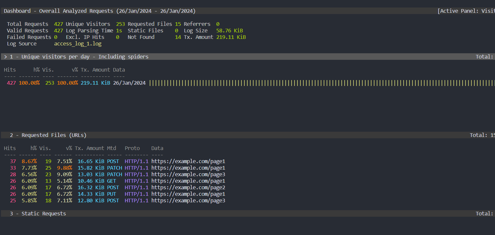

# Part 6. GoAccess
#### **Задача**:
С помощью утилиты GoAccess получить ту же информацию, что и в *Части 5*
#### **Решение**:
Для начала необходимо установить goaccess:
> sudo apt-get update

> sudo apt-get install goaccess

Анализ log-файдов с помощью *GoAccess*:
> goaccess --log-format=COMBINED [LOG FILE|FILES] 
- Необходимо выбрать формат лога в настройках
- Результат анализа: \

Команда `goaccess -o report.html --log-format=COMBINED [LOG FILE|FILES] -c` сгенерирует файл для отображения результата анализа в браузере.

#### **Параметры**:
- --log-format=COMBINED: указывает, что лог-файлы имеют формат комбинированного формата логов Nginx.
- -o report.html: указывает путь, по которому будет сохранен HTML-отчет.
- -c: запускает встроенный веб-сервер GoAccess.
