# Part 7. Prometheus и Grafana
## 1. Установка Prometheus <br/>

* Для установки `Prometheus` выполним команду <br/>
    ```sh
    sudo apt in7stall prometheus
    ```
* Запустим `Prometheus` <br/>
    ```sh
    sudo systemctl start prometheus
    ```
    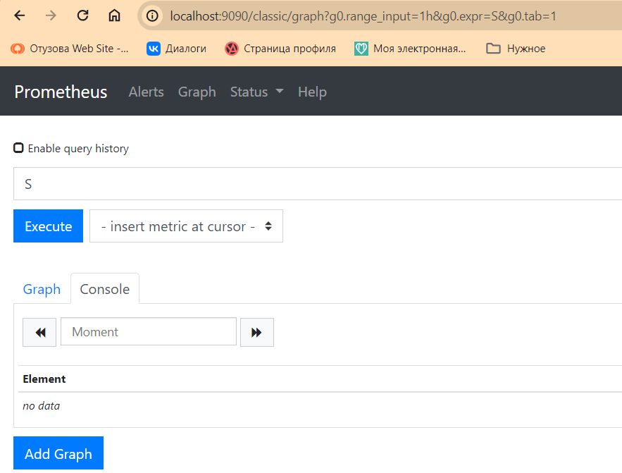
* Убедимся, что `Prometheus` запустился <br/>
    ```sh
    sudo systemctl status prometheus
    ```
    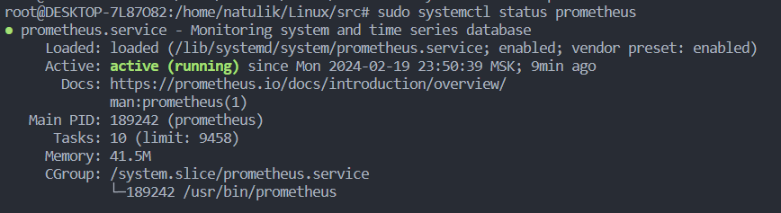

## 2. Установка Grafana <br/>

* Необходимо подключить VPN (Planet VPN)
* Пользоваться https://grafana.com/grafana/download/10.3.3?platform=linux
* Установим `Grafana` <br/>
    ```sh
    sudo apt-get install -y adduser libfontconfig1 musl
    wget https://dl.grafana.com/enterprise/release/grafana-enterprise_10.3.3_amd64.deb
    sudo dpkg -i grafana-enterprise_10.3.3_amd64.deb
    ```
* Добавим в автоматический запуск <br/>
    ```sh
    sudo /bin/systemctl daemon-reload
    sudo /bin/systemctl enable grafana-server
    sudo /bin/systemctl start grafana-server
    ```

## 3. Настройка Grafana <br/>

* В браузере перейдем по адресу `http://localhost:3000/` 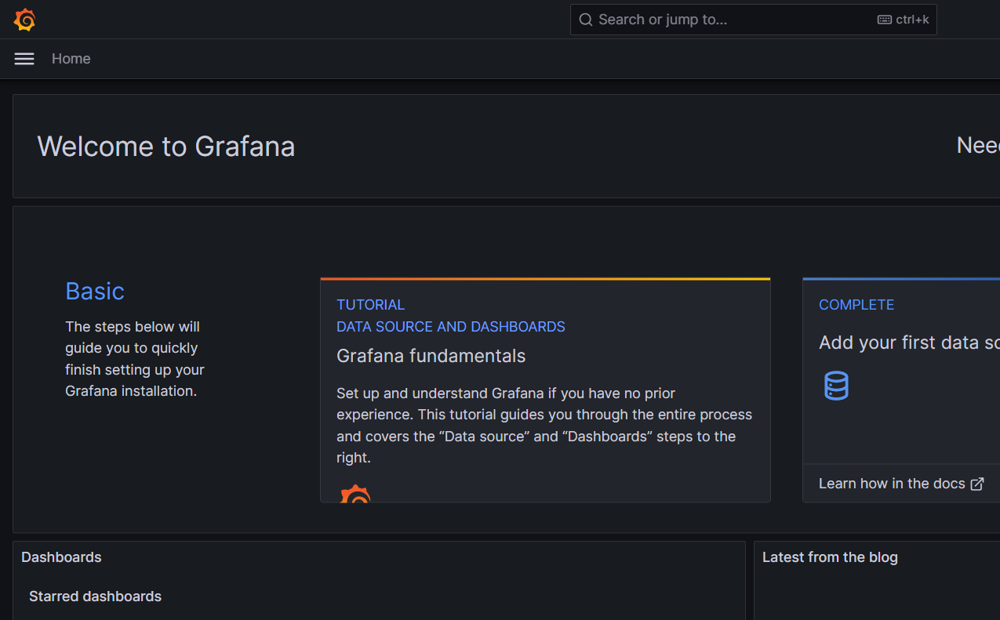
* При первом запуске вводим логин: `admin` и пароль: `admin`. После этого будет предложено заменить пароль<br/>
* После этого перейдем `Connections->Data Source` и нажимаем кнопку `Add Data Source`<br/>
* В открывшемся окне выбираем тип Data Source - `Prometheus`<br/>
* В поле URL вводим адрес сервера, на котором доступен Prometheus и его порт. Так как Grafana находится на той же машине, что и Prometheus, используем `localhost`, а порт по умолчанию `9090`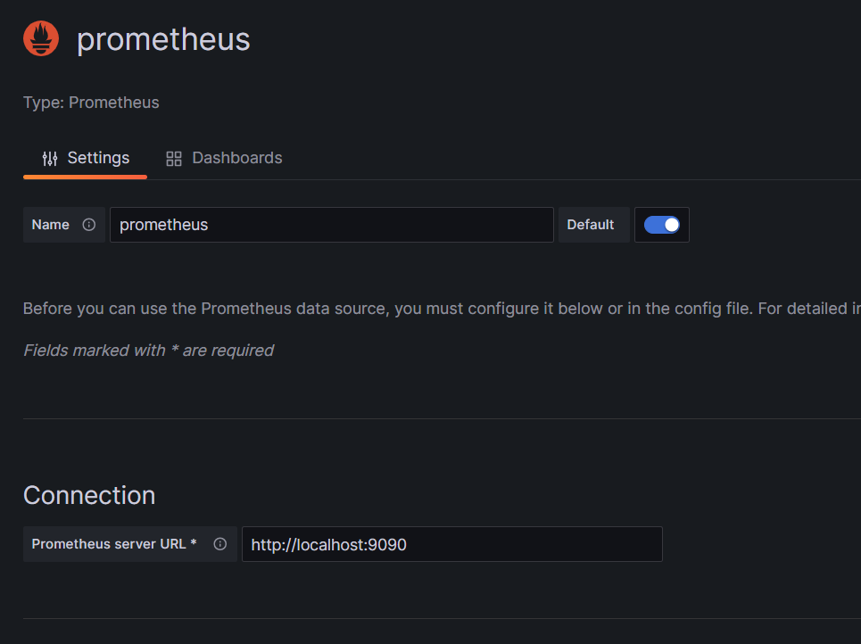
* Сохраняем изменения `Save and Test`<br/>

## 4. Создание собственных dashboards

* Для создание dashboard нажимаем `Dashboards -> New dashboard`<br/>
* Создадим панель для отображения `CPU`<br/>
    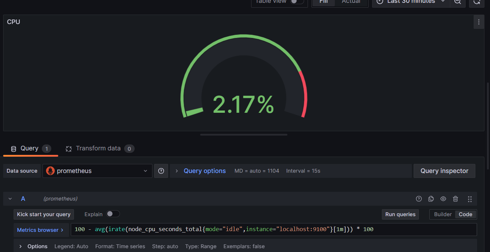
* Создaдим панель для отображения `доступной оперативной памяти`<br/>
    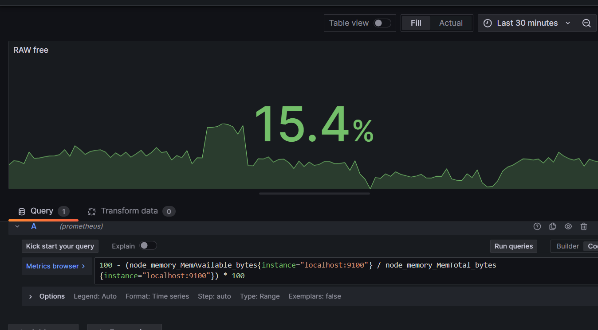
* Создадим панель для отображения объема `всей памяти`, `занятой памяти` и `свободной памяти`<br/>
    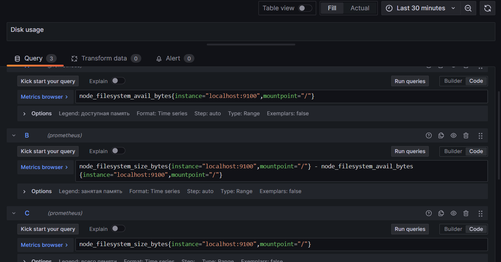
* Создадим панель для отображения `количества операций ввода/вывода на жестком диске`<br/>
   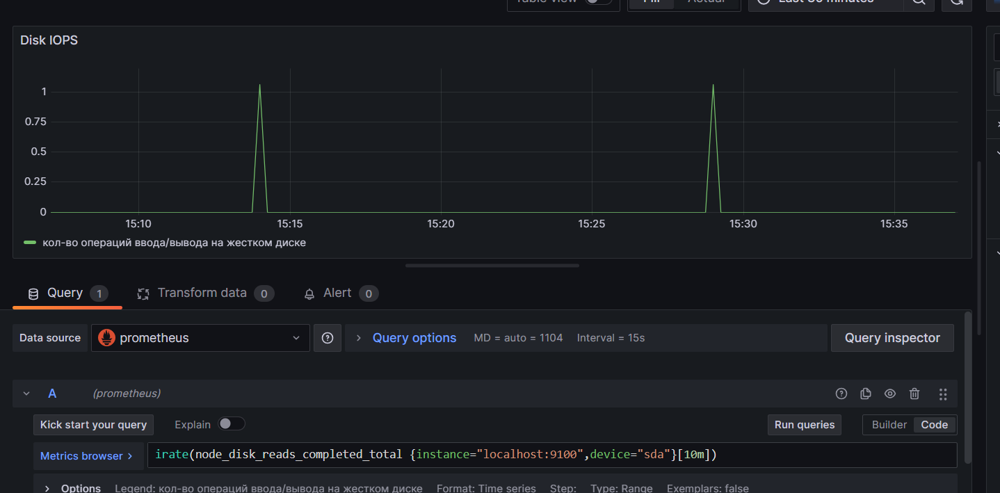
* Конечный результат
   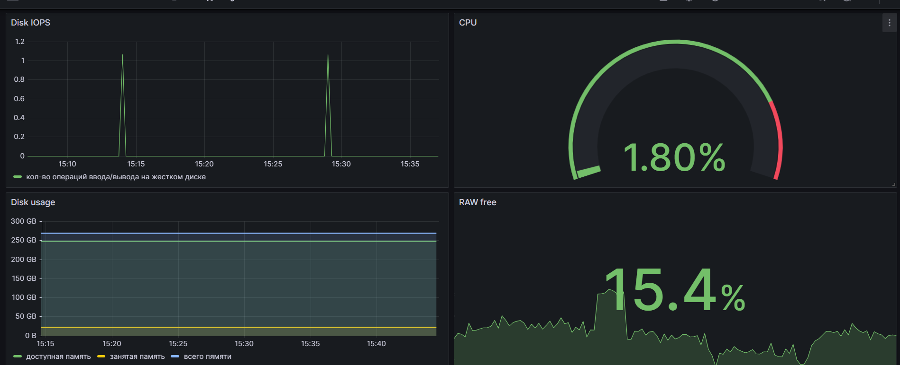

## 5. Тест созданных dashboards

* Запустим bash-скрипт из `Part 2`<br/>
* Проверим результаты работы
    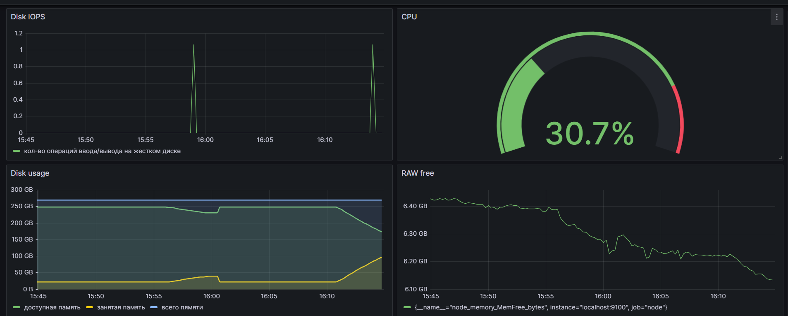
    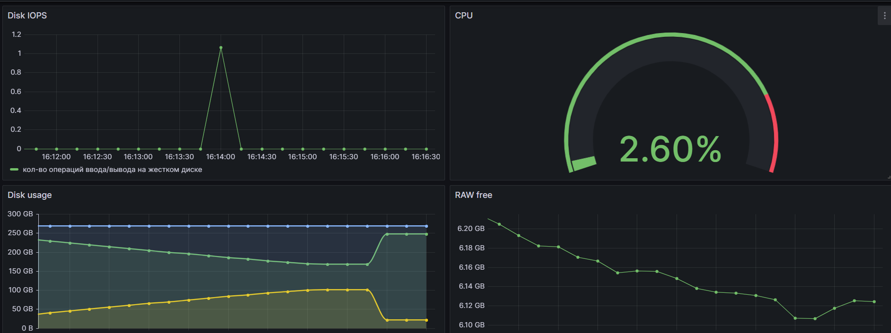
* Установим утилиту `stress`
    ```sh
    sudo apt install stress
    ```
* Запустим команду
    ```sh
    stress -c 2 -i 1 -m 1 --vm-bytes 32M -t 60s
    ```
* Проверим результаты работы
    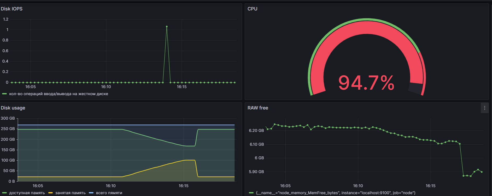