# Basic CI/CD

### Part 1. Настройка **gitlab-runner**

Подними виртуальную машину Ubuntu Server 22.04 LTS на WSL2.

> docker pull ubuntu  
> docker run -it ubuntu

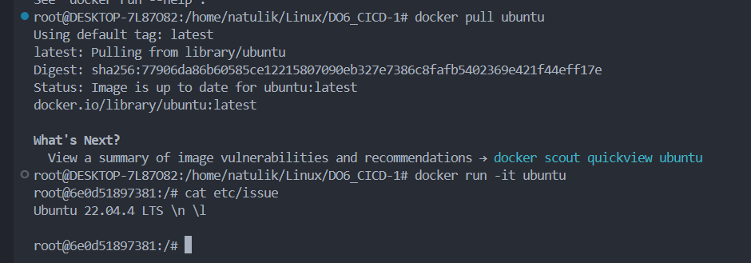

Сначала обновляем, устанавливаем нужные утилиты:
```sh
apt-get update  
apt-get upgrade  
apt-get install curl  
apt-get install gcc  
apt-get install make  
apt-get install clang-format
```

Скачиваем и устанавливаем на виртуальную машину **gitlab-runner**

> curl -L "https://packages.gitlab.com/install/repositories/runner/gitlab-runner/script.deb.sh" | bash  
> apt install gitlab-runner

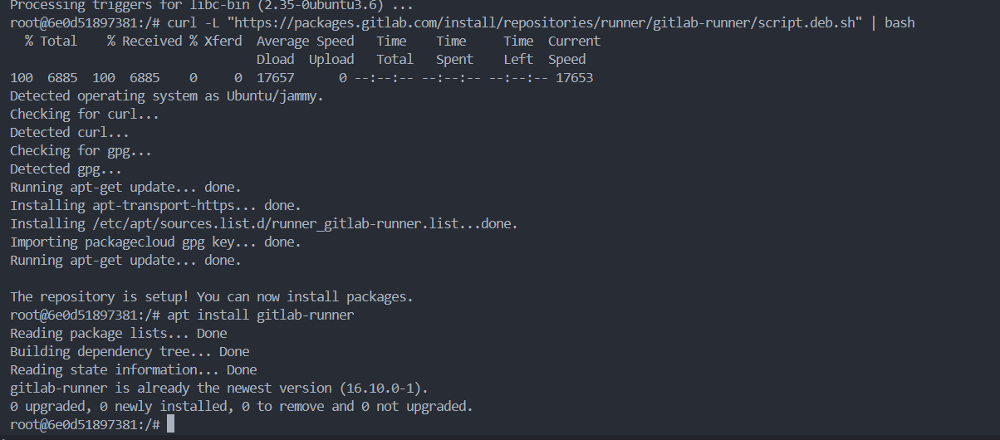

Для регистрации понадобятся URL и токен, которые можно получить на страничке задания на платформе.

> gitlab-runner register

    URL: https://repos.21-school.ru
    token: Токен с платформы
    description: Описание, по желанию. Можно пропустить
    tags: build,style,test,deploy,notify
    note: Дополнительное примечание по техническому обслуживанию. Можно пропустить
    executor: shell

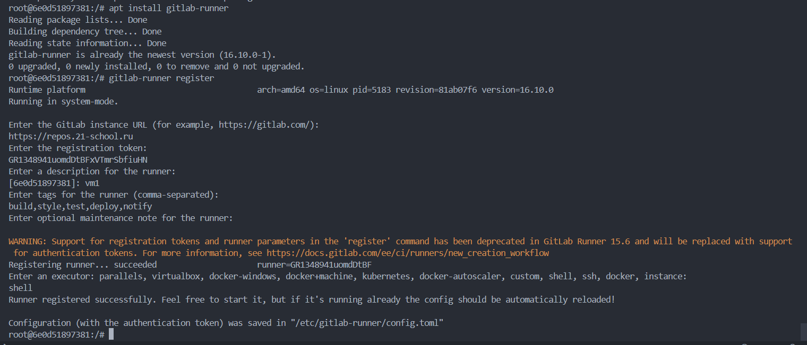

### Part 2. Сборка

Копируем папки cat и grep из проекта simpleBashUtils в папку src проекта CI/CD:

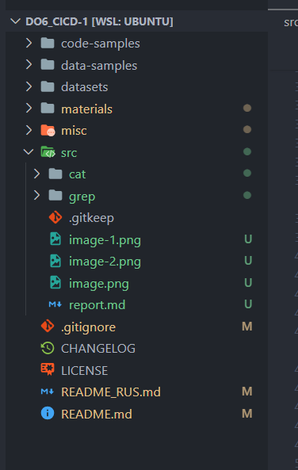

Cоздаём файл .gitlab-ci.yml.

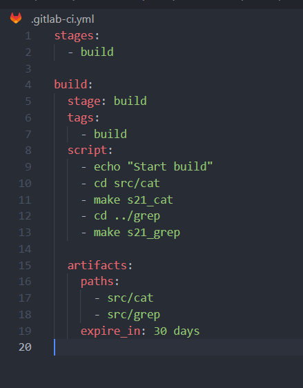
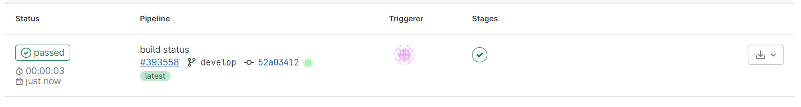

### Part 3. Тест кодстайла

Добавляем **- codestyle** в **stages** и дописываем стадию **codestyle**.

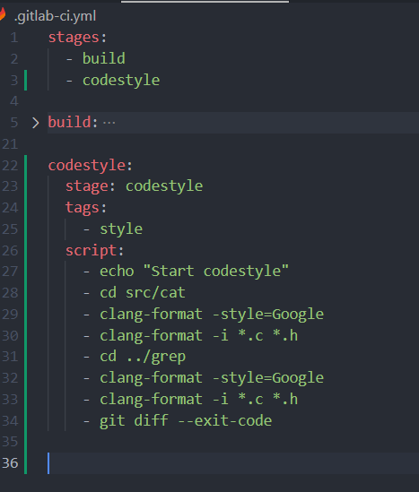

Первый раз кодстайл нашёл ошибки.

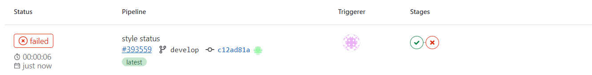

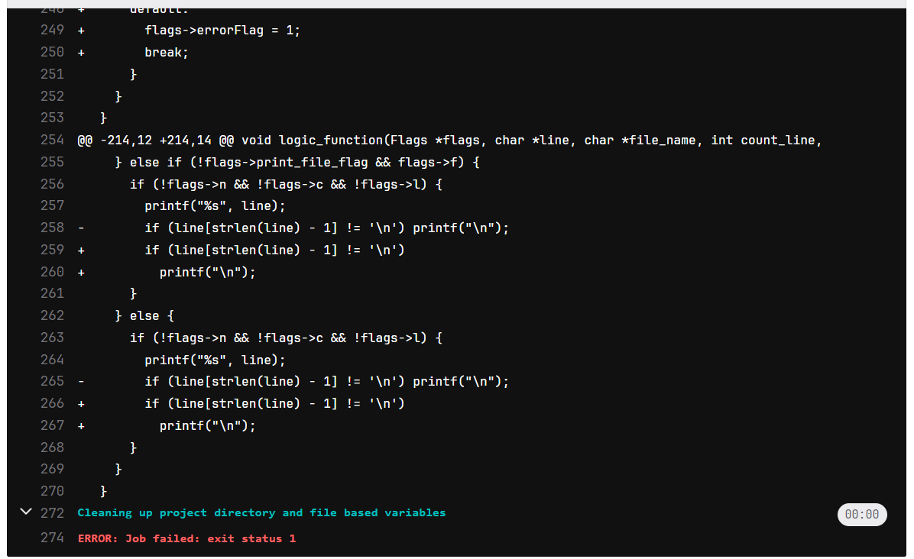

После исправления всё было пройдено.

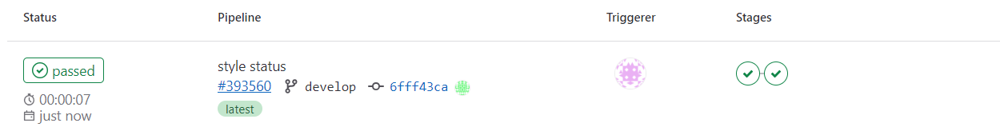

### Part 4. Интеграционные тесты

Добавляем **- test** в **stages** и дописываем стадию **test**.

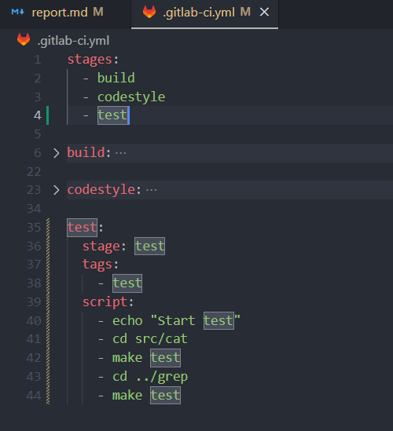

Тесты успешно пройдены.

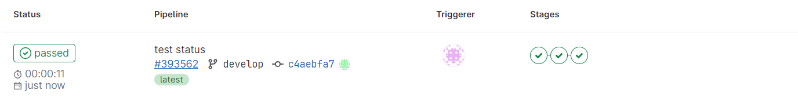

### Part 5. Этап деплоя

Создаем второй контейнер аналогично тому, как мы это делали в первом пункте. В докере контейнеры находятся в одной подсети, поэтому достаточно настройки ssh. Устанавливаем и включаем ssh на обеих машинах:

> apt-get install openssh-server  
> service ssh start

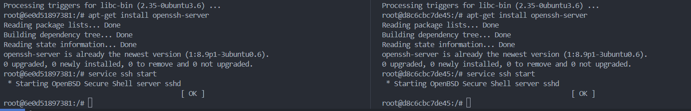
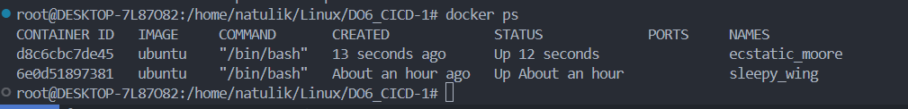

На второй машине добавляем нового пользователя с паролем, переключаемся на него (`su user`).

Через root даем права на папку:

> chmod 777 /usr/local/bin/

На первой машине переключаемся на пользователя gitlab-runner (`su gitlab-runner`). Генерируем новый ssh-ключ для второй машины командой ssh-keygen:

> ssh-keygen -t rsa -b 2048

Копируем ключ, указывая адрес и пользователя второй машины:

> ssh-copy-id user@172.17.0.3

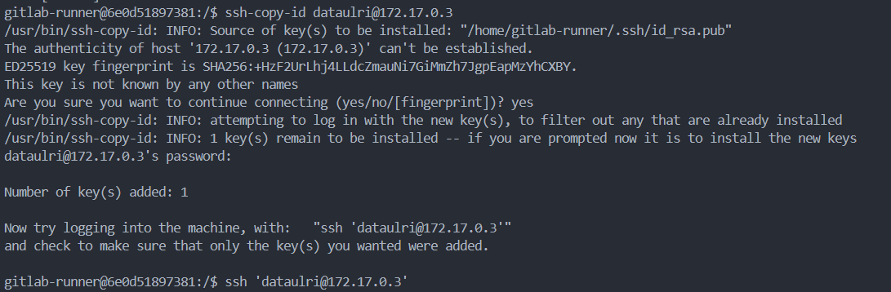

Создаём файл `deploy.sh` и добавляем **- deploy** в **stages** и дописываем стадию **deploy**.

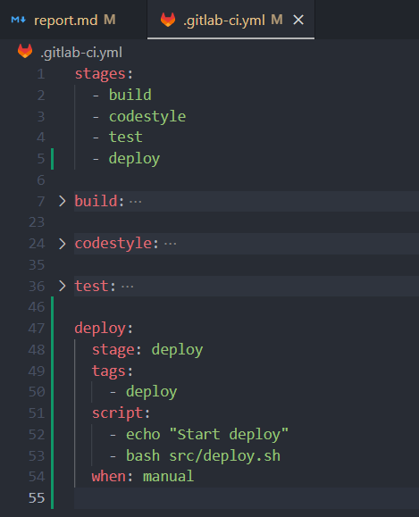

После успешного прохождения этапов сборки, стиля и теста, стадия деплоя ждет ручного запуска.

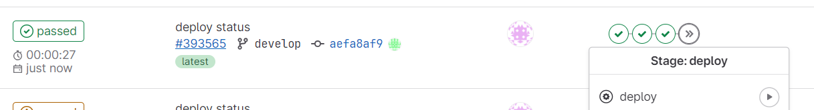

Запускаем, деплой проходит успешно.

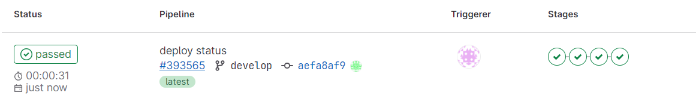

Важно! Для успешного прохождения deploy на исходной машине нужно перейти в созданного пользователя, а в принимающей машине остаться в пользователе root.

### Part 6. Дополнительно. Уведомления

Создаем файл telegram_bot.sh. К каждому этапу добавляем скрипт:

```sh
after_script:
    - sh src/telegram_bot.sh "stage name"
```

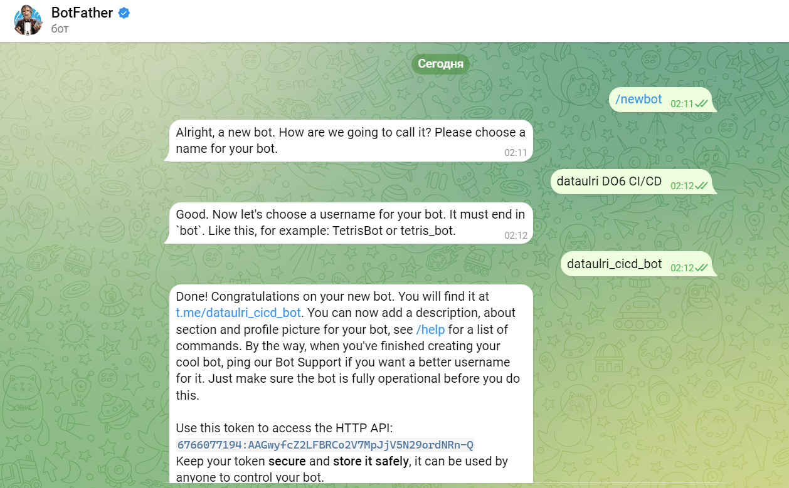

Переходим в телеграме в @userinfobot. Находим ID, указываем в telegram_bot.sh.

Уведомления о успешном/неуспешном выполнении пайплайна.

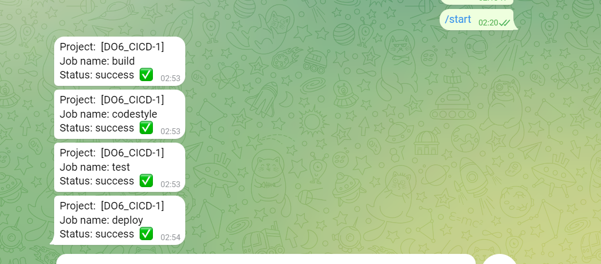
